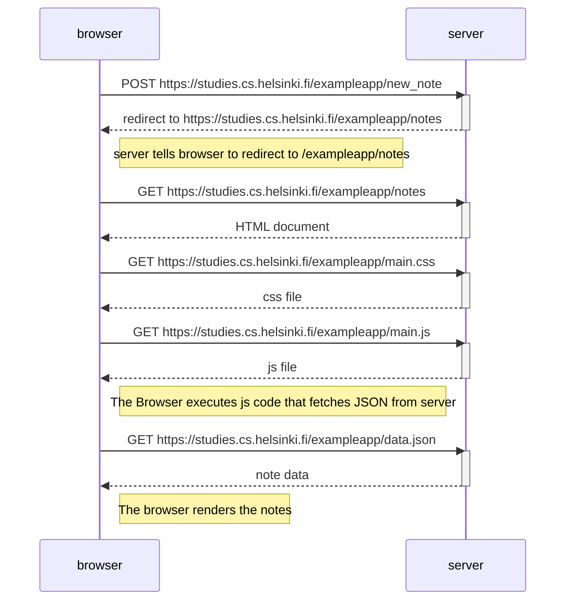

```mermaid
sequenceDiagram
  participant browser
  participant server

  browser ->>server: POST https://studies.cs.helsinki.fi/exampleapp/new_note
  activate server

  server-->>browser: redirect to https://studies.cs.helsinki.fi/exampleapp/notes
  deactivate server

  Note right of browser: server tells browser to redirect to /exampleapp/notes

  browser ->>server: GET https://studies.cs.helsinki.fi/exampleapp/notes
  activate server
  server-->>browser: HTML document
  deactivate server

  browser ->>server: GET https://studies.cs.helsinki.fi/exampleapp/main.css
  activate server
  server-->>browser: css file
  deactivate server

browser ->>server: GET https://studies.cs.helsinki.fi/exampleapp/main.js
  activate server
  server-->>browser: js file
  deactivate server
  Note right of browser: The Browser executes js code that fetches JSON from server

  browser ->>server: GET https://studies.cs.helsinki.fi/exampleapp/data.json
  activate server
  server-->>browser: note data
  deactivate server
  Note right of browser: The browser renders the notes
```
